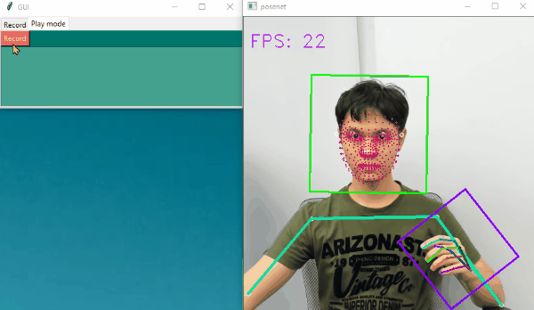

# Shuwa
 Shuwa ML is a Deep Learning model pipeline that classify sign language from input video, Implemented in tensorflow2.  
 You can try our web demo here — [demo](/web_demo)


# How it works
By combining pose, face, and hand detector results over multiple frames we can acquire a fairly requirement for sign language understanding includes body movement, facial movement, and hand gesture. After that we use DD-Net as a recognitor to predict sign features represented in the 832D vector. Finally using use K-Nearest Neighbor classification to output the class prediction.  

All related models listed below.

- >[PoseNet](https://github.com/tensorflow/tfjs-models/tree/master/posenet): Pose detector model.
- >[FaceMesh](https://google.github.io/mediapipe/solutions/face_mesh) : Face keypoints detector model.
- >[HandLandmarks](https://google.github.io/mediapipe/solutions/hands) : Hand keypoints detector model.
- >[DD-Net](https://github.com/fandulu/DD-Net) : Skeleton-based action recognition model.


# Run Python webcam demo
```
python webcam_demo_knn.py
```
You can also press 'R' to start/stop recording.

- Use record mode to add more sign.  


- Play mode.  
  


# Run Detector demo
You can try each detector individually by using these scripts.
- FaceMesh demo
```
python face_landmark\webcam_demo_face.py
```

- PoseNet demo
```
python posenet\webcam_demo_pose.py
```

- HandLandmarks demo
```
python hand_landmark\webcam_demo_hand.py
```

# Train classifier from scratch
Usually you can add a custom sign by using Record mode in the full demo program.  
But in case you want to train the classifier from scratch you can check out the process —[here](/classifier)